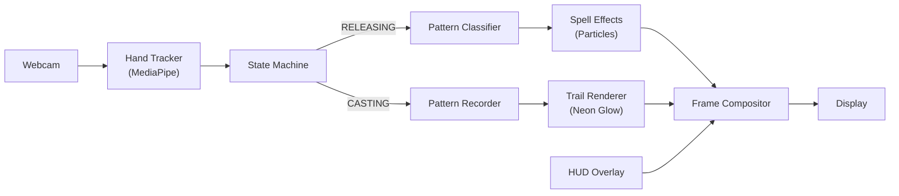

# 🧙‍♂️ Gesture Spell Caster — Walkthrough

## What Was Built

A **real-time spell casting system** that uses your webcam and hand gestures to cast visual spells with particle effects. Draw magical patterns in the air and watch fire, lightning, shields, and more erupt from your fingertip!

## Files Created

All files live in `/Users/apple/Desktop/CV_projects/spell_caster/`:

| File | Purpose |
|------|---------|
| [config.py](file:///Users/apple/Desktop/CV_projects/spell_caster/config.py) | All tunable constants — colors, thresholds, mana costs, particle settings |
| [hand_tracker.py](file:///Users/apple/Desktop/CV_projects/spell_caster/hand_tracker.py) | MediaPipe wrapper — hand detection, fingertip tracking, gesture pose detection |
| [spell_patterns.py](file:///Users/apple/Desktop/CV_projects/spell_caster/spell_patterns.py) | Records fingertip trail, extracts geometric features, classifies spell patterns |
| [spell_effects.py](file:///Users/apple/Desktop/CV_projects/spell_caster/spell_effects.py) | Particle physics engine with 6 unique spell effect subclasses |
| [trail_renderer.py](file:///Users/apple/Desktop/CV_projects/spell_caster/trail_renderer.py) | Neon glow trail with Gaussian blur bloom following the fingertip |
| [hud.py](file:///Users/apple/Desktop/CV_projects/spell_caster/hud.py) | Mana bar, spell name flash, FPS, state badge, spell book panel |
| [main.py](file:///Users/apple/Desktop/CV_projects/spell_caster/main.py) | Main orchestrator — webcam loop, 4-state machine, rendering pipeline |
| [README.md](file:///Users/apple/Desktop/CV_projects/spell_caster/README.md) | Full documentation with setup, controls, and spell reference |

## Architecture



### State Machine Flow

```
IDLE  ──(index finger raised)──▶  CASTING  ──(fist)──▶  RELEASING  ──(spell matched)──▶  SPELL_ACTIVE
  ▲                                                                                          │
  └──────────────────────────────(effects finished)──────────────────────────────────────────┘
```

## How to Run

```bash
cd /Users/apple/Desktop/CV_projects/spell_caster
python3 main.py
```

## Controls

| Gesture / Key | Action |
|--------------|--------|
| ☝️ Index finger up | Start casting mode |
| ✊ Fist | Release the spell |
| **H** key | Toggle spell book |
| **R** key | Refill mana |
| **Q** key | Quit |

## Spell Reference

| Pattern | Spell | Mana |
|---------|-------|------|
| ⭕ Circle | Shield (blue bubble) | 25 |
| △ Triangle | Fire Blast (orange particles) | 30 |
| ⚡ Zigzag | Lightning (electric bolts) | 35 |
| ∞ Figure-8 | Heal (green spirals) | 20 |
| ✦ Star | Arcane Burst (purple nova) | 40 |
| ↑ Swipe Up | Wind Gust (white streaks) | 15 |

## Dependencies Installed

- `opencv-python` 4.13.0
- `mediapipe` 0.10.35
- `numpy` (already present)
